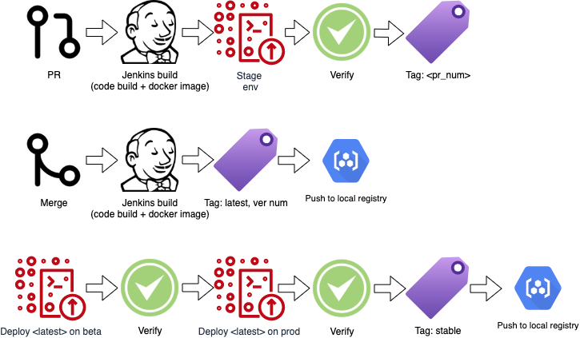

## How to:

### Before you start, please ensure `git` / `ansible` / `docker-compose` are installed.
- Clone the repo: ```git clone https://github.com/ctepx25/panaya.git /tmp/panaya/```
- To start env, please run  ``` ansible-playbook /tmp/panaya/ansible.yaml ```  and type ```deploy```.
- To restart nginx server:  ``` ansible-playbook /tmp/panaya/ansible.yaml ```  and type ```restart```. 
- To terminate: ``` ansible-playbook /tmp/panaya/ansible.yaml ```  and type ```terminate```.

##
### Nice to have CI pipeline:

